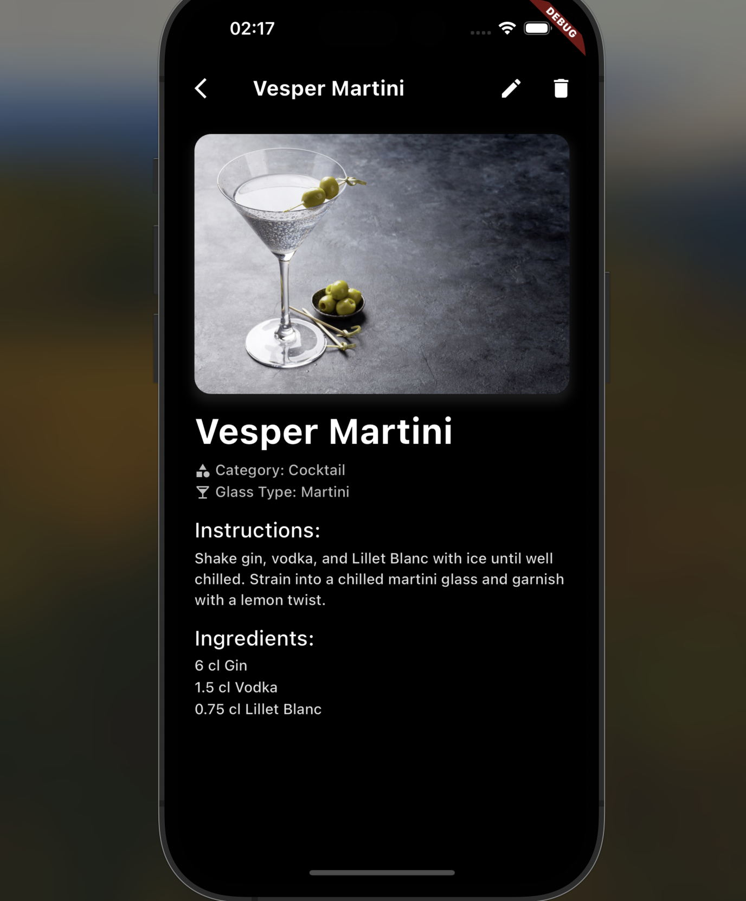
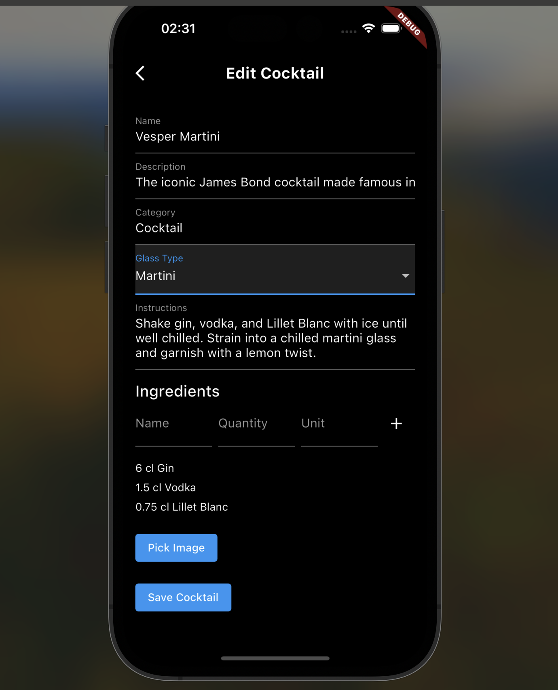
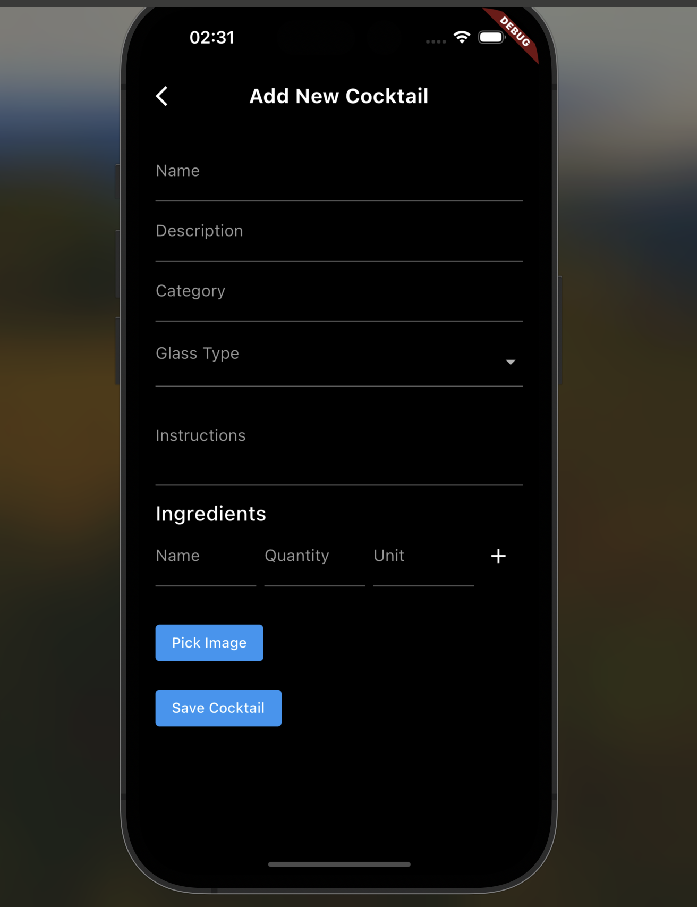
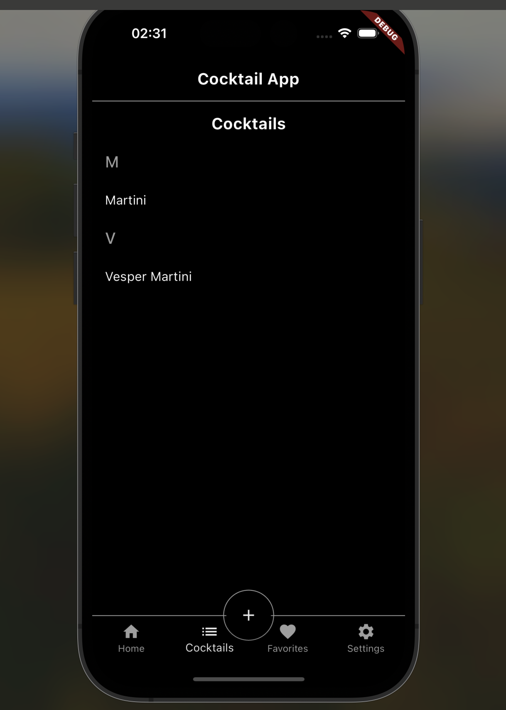

🍸 Cocktail Flutter App
Welcome to Cocktail Flutter App, a beautifully designed app built with Flutter for cocktail enthusiasts. Whether you’re an amateur mixologist or a professional bartender, this app provides you with everything you need to craft delicious cocktails. Explore recipes, add your custom creations, and enjoy a sleek, intuitive interface designed for ease of use and aesthetics.

🌟 Features
View Cocktail Recipes: Browse a collection of cocktail recipes with detailed instructions, ingredient lists, and serving suggestions.
Custom Cocktail Creation: Add your own cocktails with images, ingredients, and instructions.
Edit & Delete: Easily edit and remove your cocktails.
Image Support: Take or select photos for each cocktail.
Categories & Glass Types: Organize cocktails by categories and recommended glass types for an authentic experience.

## 📱 Screenshots

### Details Page

### Edit Cocktail

### Add a New Cocktail

### Cocktail list alphabetical

🚀 Getting Started
Follow these instructions to set up and run the project locally.

Prerequisites
Ensure you have the following installed:

Flutter
Android Studio or Xcode for iOS development
Installation
